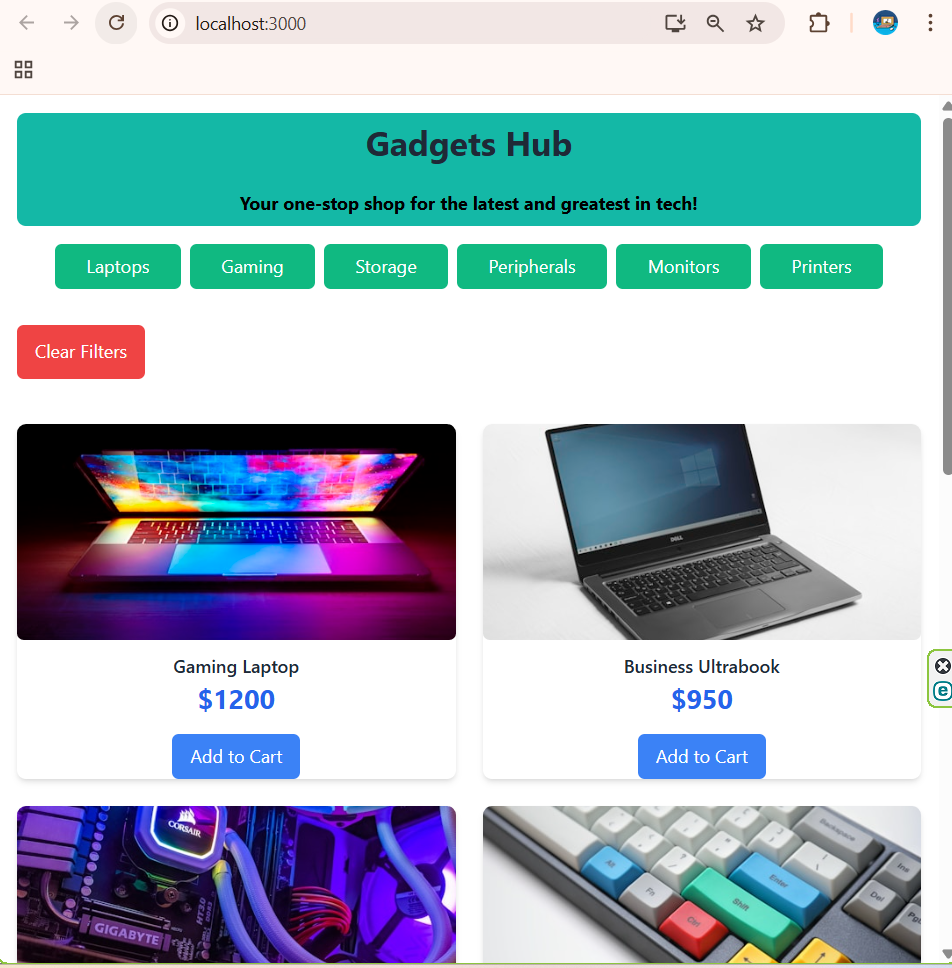
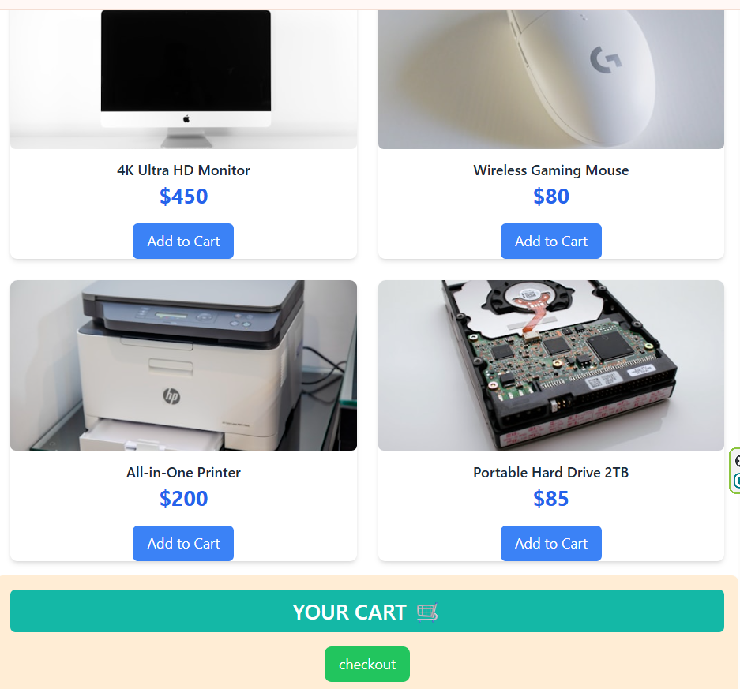

# Simple E-Commerce UI 🛒
> **Simple E-commerce UI using React and TailwindCSS** .
---


## 📸 Screenshots

### 🖼️ Homepage






## 📂 Project Structure
```
my-app/
  ├── node_modules/
  ├── public/
  ├── src/
  │   ├── components/
  │   │   ├── LeftPanel/
  │   │   │   ├── Products/
  │   │   │   │   ├── ProductCard.jsx
  │   │   │   │   └── ProductGrid.jsx
  │   │   │   ├── filter_section.jsx
  │   │   │   └── Left_Panel.jsx
  │   │   └── RightPanel/
  │   │       └── Right_Panel.jsx
  │   ├── App.css
  │   ├── App.jsx
  │   ├── App.test.js
  │   ├── index.css
  │   └── index.js
  ├── .gitignore
  ├── package.json
  ├── package-lock.json
  ├── tailwind.config.js
  └── README.md
```
## ✨ Features
- **Product Catalog:** Browse 8+ tech products across 6 categories
- **Smart Filtering:** Filter products by categories (Laptops, Gaming, Storage, Peripherals, Monitors, Printers)
- **Shopping Cart:** Real-time cart updates with add/remove/quantity controls
- **Price Calculator:** Automatic total price calculation
- **Responsive Design:** Optimized for mobile, tablet, and desktop (66/33 split on desktop)
- **Interactive UI:** Hover effects, smooth transitions, and modern card designs
- **Category Badges:** Visual product categorization
- **Empty State:** Engaging empty cart illustration
---
## 🛠️ Tech Stack
- **Frontend:** React 18
- **Styling:** TailwindCSS
- **Build Tool:** Create React App
- **State Management:** React Hooks (useState)
- 
---
## 🚀 Getting Started
1. **Clone the repository**

bash
```
git clone https://github.com/yourusername/simple-e-commerce.git
cd simple-e-commerce
```

3. **Install dependencies**
 
bash
```
npm install
```

4. **Verify TailwindCSS is configured**
 bash
```
- Check tailwind.config.js and ensure content paths are correct
- Verify index.css imports Tailwind directives
 ```
  
4. **Run the development server**

 bash
```
npm start
```

5. **Open in browser**
 bash
 ```

-Visit [http://localhost:3000](http://localhost:3000)
 ```

## 📸 Screenshots

*Browse products with beautiful card layouts*

*Manage your cart with ease*
---

### Responsive Design
- **Mobile (< 640px):** Single column product grid, stacked layout
- **Tablet (640px - 1024px):** Two column product grid
- **Desktop (> 1024px):** 66% products / 33% cart split, up to 3 columns
- **XL screens (> 1280px):** Three column product grid for maximum efficiency
---
## 🔧 Configuration
### TailwindCSS Setup
```
Ensure your tailwind.config.js includes:
javascript
module.exports = {
  content: [
    "./src/**/*.{js,jsx,ts,tsx}",
  ],
  theme: {
    extend: {},
  },
  plugins: [],
}
```
## 📄 License
This project is licensed under the MIT License - see the [LICENSE](LICENSE) file for details.
---
